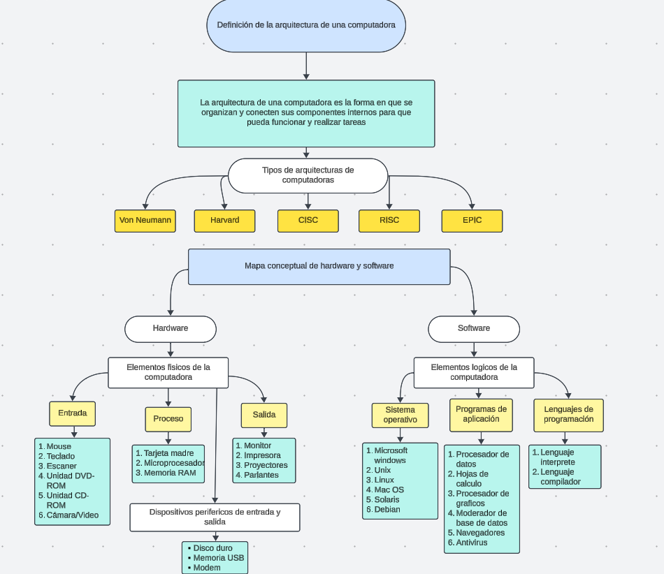

# Bitácora de la Unidad 1

### Estudiante:  Jose Ignacio Trujillo Cano
### ID:  000335384

1. ###  Realiza un listado de todos los componentes de hardware y software.

R//
Hardware
-   Unidad central de procesamiento (CPU)
-   Placa Base
-   Memoria RAM
-   Memoria ROM
-   Memoria caché
-   Unidades de almacenamiento
-   Fuente de alimentación
-   Disco Duro
-   Tarjeta de video (GBU)
-   Caja o gabinete
-   Tarjeta de sonido 
-   Ventiladores y disipadores de calor
-   Periféricos

Software
-   Navegador web
-   Suite de productividad
-   Software de gráficos y edición de fotos
-   Reproductores multimedia
-   Programas de mensajería
-   Software de seguridad
-   Software de edición de video
-   Software de juegos
-   Utilidades del sistema

2. ### Redacta una definición de la arquitectura de una computadora con tus propias palabras. Enumera las diferentes variantes de arquitecturas que existen.

R//
La arquitectura de una computadora es la forma en que se organizan y conectan sus componentes internos para que pueda funcionar y realizar tareas.

Tipos de arquitecturas de computadoras:

1.   Von Neumann: Usa una sola memoria para datos e instrucciones, lo que puede causar lentitud.
2.   Harvard: Tiene memorias separadas para datos e instrucciones, lo que permite que sean más rápidas.
3.   CISC (Complex Instruction Set Computer): Usa muchas instrucciones complejas para realizar tareas con menos pasos.
4.   RISC (Reduced Instruction Set Computer): Usa instrucciones simples y rápidas para ser más eficiente.
5.   MISC (Minimal Instruction Set Computer): Usa un número muy reducido de instrucciones para simplificar el hardware.
6.   EPIC (Explicitly Parallel Instruction Computing): Permite ejecutar muchas instrucciones al mismo tiempo.

 Organiza los resultados de la búsqueda en un mapa conceptual.

 Profundiza en la CPU de la computadora. Investiga y agrega al mapa los componentes internos de la CPU.

